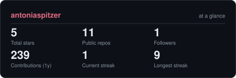
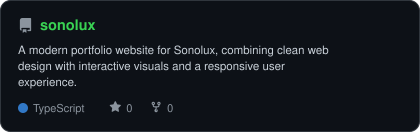
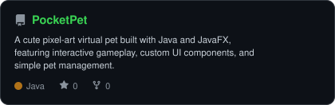
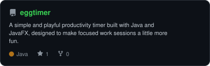
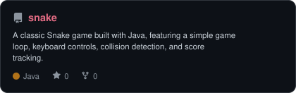
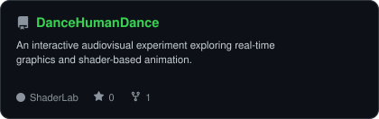
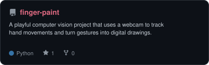

<div align="center">

<!-- PORTRAIT - generated by scripts/dotify.py from assets/jacket.png.
     Colour mode, so one file serves both GitHub themes. Regenerate with:
       python scripts/dotify.py assets/jacket.png -o assets/portrait \
         --cols 100 --equalize --detail 0.5 --color -->


<br>

<!-- NAME / TAGLINE - animated typing -->
<a href="https://github.com/antoniaspitzer">
  
</a>

<br>

<!-- SOCIALS -->
<a href="https://linkedin.com/in/antonia-spitzer-828940397"></a>
<a href="mailto:antoniaspi123@gmail.com"></a>
<a href="https://sonolux.at/antonia"></a>


</div>

---

## `~/` whoami

```console
$ cat about.txt
```

Hi, I'm **Antonia Spitzer** -- a Media Technology & Design student with a growing focus on software engineering and programming.
My studies have given me a broad background ranging from design and UX to game development, audio/video and web technologies. But the part I enjoy most is building things with code — especially web applications and software that turn an idea into something people can actually use.

- Studying **Media Technology & Design (BSc)** at FH Hagenberg
- Interested in Software Engineering, Full-Stack Development & Programming
- Portfolio: **[Click here](https://www.sonolux.at/antonia)**
- Long-term goal: continue into **Software Engineering** and pursue the **SE Master's programme** at FH Hagenberg
- Currently building **[Sonolux](https://github.com/antoniaspitzer/sonolux)** and **[PocketPet](https://github.com/antoniaspitzer/PocketPet)**

<br>

<div align="center">

## `~/` toolbox

 </div>

</div>

---

<div align="center">

## `~/` skill radar

<table>
<tr>
<td width="50%" align="center" valign="middle">

<!-- Self-rated radar - edit assets/skills.json, the workflow redraws it -->
<picture>
  <source media="(prefers-color-scheme: dark)"  srcset="assets/radar-dark.svg">
  <source media="(prefers-color-scheme: light)" srcset="assets/radar-light.svg">
  
</picture>

</td>
<td width="50%" align="center" valign="middle">

<!-- Live radar built from real language byte counts across your repos -->
<picture>
  <source media="(prefers-color-scheme: dark)"  srcset="assets/radar-langs-dark.svg">
  <source media="(prefers-color-scheme: light)" srcset="assets/radar-langs-light.svg">
  
</picture>

</td>
</tr>
</table>

</div>

---

<div align="center">

## `~/` contribution calendar

<!-- 3D isometric calendar, regenerated every 6h by .github/workflows/metrics.yml -->


<br><br>

<!-- Snake eats the contribution graph - .github/workflows/snake.yml -->
<picture>
  <source media="(prefers-color-scheme: dark)"  srcset="https://raw.githubusercontent.com/antoniaspitzer/antoniaspitzer/output/snake-dark.svg">
  <source media="(prefers-color-scheme: light)" srcset="https://raw.githubusercontent.com/antoniaspitzer/antoniaspitzer/output/snake.svg">
  
</picture>

</div>

---

<div align="center">

## `~/` the numbers

<!-- Generated by scripts/cards.py into this repo. Deliberately NOT
     github-readme-stats / streak-stats / github-profile-trophy: those are
     shared public instances that go down and take the whole section with them. -->
<picture>
  <source media="(prefers-color-scheme: dark)"  srcset="assets/card-stats-dark.svg">
  <source media="(prefers-color-scheme: light)" srcset="assets/card-stats-light.svg">
  
</picture>

<br>


<br><br>


</div>

---

<div align="center">

## `~/` selected work

<!-- Cards generated by scripts/cards.py from assets/projects.json.
     Stars, forks and language are pulled live from the API on every run. -->
<table>
  <tr>
    <td width="50%">
      <a href="https://github.com/antoniaspitzer/sonolux">
        <picture>
          <source media="(prefers-color-scheme: dark)" srcset="assets/card-sonolux-dark.svg">
          <source media="(prefers-color-scheme: light)" srcset="assets/card-sonolux-light.svg">
          
        </picture>
      </a>
    </td>

    <td width="50%">
      <a href="https://github.com/antoniaspitzer/PocketPet">
        <picture>
          <source media="(prefers-color-scheme: dark)" srcset="assets/card-PocketPet-dark.svg">
          <source media="(prefers-color-scheme: light)" srcset="assets/card-PocketPet-light.svg">
          
        </picture>
      </a>
    </td>
  </tr>

  <tr>
    <td width="50%">
      <a href="https://github.com/antoniaspitzer/eggtimer">
        <picture>
          <source media="(prefers-color-scheme: dark)" srcset="assets/card-eggtimer-dark.svg">
          <source media="(prefers-color-scheme: light)" srcset="assets/card-eggtimer-light.svg">
          
        </picture>
      </a>
    </td>

    <td width="50%">
      <a href="https://github.com/antoniaspitzer/snake">
        <picture>
          <source media="(prefers-color-scheme: dark)" srcset="assets/card-snake-dark.svg">
          <source media="(prefers-color-scheme: light)" srcset="assets/card-snake-light.svg">
          
        </picture>
      </a>
    </td>
  </tr>

  <tr>
    <td width="50%">
      <a href="https://github.com/antoniaspitzer/DanceHumanDance">
        <picture>
          <source media="(prefers-color-scheme: dark)" srcset="assets/card-DanceHumanDance-dark.svg">
          <source media="(prefers-color-scheme: light)" srcset="assets/card-DanceHumanDance-light.svg">
          
        </picture>
      </a>
    </td>

    <td width="50%">
      <a href="https://github.com/antoniaspitzer/finger-paint">
        <picture>
          <source media="(prefers-color-scheme: dark)" srcset="assets/card-finger-paint-dark.svg">
          <source media="(prefers-color-scheme: light)" srcset="assets/card-finger-paint-light.svg">
          
        </picture>
      </a>
    </td>
  </tr>
</table>

<sub>

| project | description | stack |
|---|---|---|
| **[sonolux](https://github.com/antoniaspitzer/sonolux)** | Website for Sonolux GmbH | `TypeScript` `React` `Web Development` |
| **[PocketPet](https://github.com/antoniaspitzer/PocketPet)** | A small pixel-art desktop pet built to explore Java and JavaFX | `Java` `JavaFX` |
| **[eggtimer](https://github.com/antoniaspitzer/eggtimer)** | A cute productivity timer built with JavaFX | `Java` `JavaFX` |
| **[fingerpaint](https://github.com/antoniaspitzer/finger-paint)** | A camera-based drawing experiment controlled with hand movements | `Python` `Computer Vision` |

</sub>

</div>

---

<div align="center">

<sub>`01110100 01101000 01100001 01101110 01101011 01110011 00100000 01100110 01101111 01110010 00100000 01110011 01100011 01110010 01101111 01101100 01101100 01101001 01101110 01100111`</sub>

</div>
